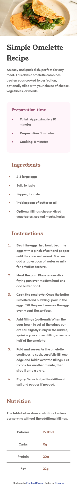
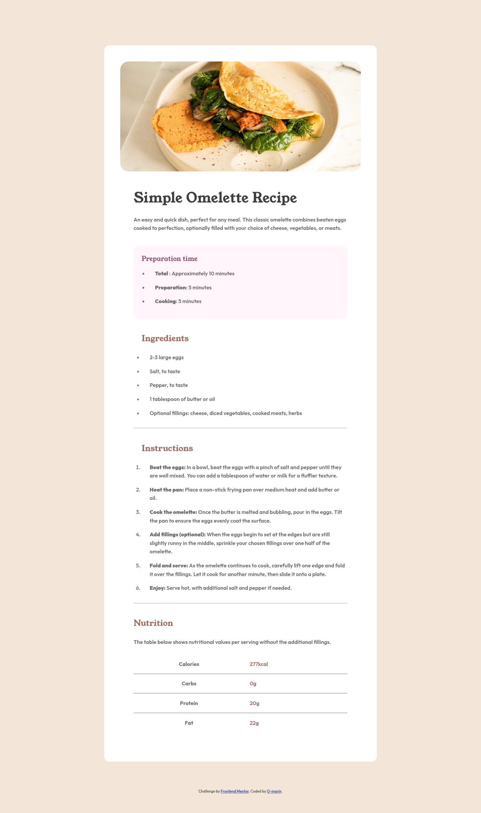

# Frontend Mentor - Recipe page solution

This is a solution to the [Recipe page challenge on Frontend Mentor](https://www.frontendmentor.io/challenges/recipe-page-KiTsR8QQKm). Frontend Mentor challenges help you improve your coding skills by building realistic projects. 

## Table of contents

- [Overview](#overview)
  - [Screenshot Mobile](#screenshot Mobile)
- [Screenshot Desktop](#screenshot Desktop)
  - [Links](#links)
- [My process](#my-process)
  - [Built with](#built-with)
  - [What I learned](#what-i-learned)
  - [Continued development](#continued-development)
  - [Useful resources](#useful-resources)
- [Author](#author)
- [Acknowledgments](#acknowledgments)

## Overview
	Webpage for an Omellete, it contains a brief description, the time it takes to prepare and cook. Ingredients, Instructions and nutrition table. 

### Screenshot Mobile

###Screemsjpt Desktop

 

### Links

- Solution URL: [O-marinOmeletteRecipe](https://github.com/O-Marin/omeletteRecipe)
- Live Site URL: [OmeletteRecipe](https://o-marin.github.io/omeletteRecipe/)

## My process
1.- Read documentation
2.-Find all the fonts and external elements I will need
3.-Check the models, this includes counting the sections and sketching the page in the mind first.
4.-lay down html. This part includes the content.
5.-define custom variables, for this particular proyect I used custom variables for the colors , fonts and font weights given in the style documentation.
 6.-Start laying down the foundations of the mobile version first using media queries. With foundations I mean the margins, fonts, colors. If they are the same in both versions I can place them in a common segment in the css document.
7.-Add the details and lining up the margins paddings and refine the distances between elements.

### Built with

 Semantic HTML5 markup
 CSS and CSS custom properties
 Flexbox
 Mobile-first workflow

### What I learned

I applied media queries which I hadn't before, learned about the nth-child() for the nutritional table
In general this first excercise opened a lot of doors and windows for me to explore as I move on my front end journey.

One of the things I particularly enjoyed was choosing between 2 different banners depending on the size of the screen, with display none and media queries. Not because its a particularly good looking fragment of code or particularly difficult,
 but because I had to think about it.

### Continued development

Use this section to outline areas that you want to continue focusing on in future projects. These could be concepts you're still not completely comfortable with or techniques you found useful that you want to refine and perfect.

I intend to keep focusing on media queries and learning about color theory.

### Useful resources

For this proyect I didn't use anything particularly worth mentioning, I did google questions that arised during the proyect.
Used Stackoverflow and MDN.

## Author

- Frontend Mentor - [@O-Marin](https://www.frontendmentor.io/profile/O-Marin)

## Acknowledgments
Thanks to my Bootcamp teacher for showing me  frontend mentor

